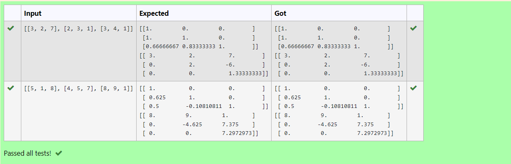
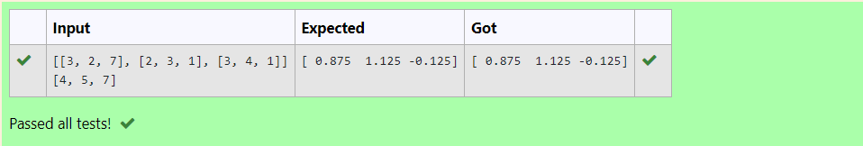

# LU Decomposition 

## AIM:
To write a program to find the LU Decomposition of a matrix.

## Equipments Required:
1. Hardware – PCs
2. Anaconda – Python 3.7 Installation / Moodle-Code Runner

## Algorithm
1. Import numpy library using import statement
2. Get two inputs from user and pass it as matrix array.
3. Find lu and pivot value of first marix using lu_factor().
4. Find solution of the matrix by using lu_solve() by passing lu, pivot values as first argument and second matrix as second argument.

## Program:
(i) To find the L and U matrix
```
Program to find L and U matrix using LU decomposition.
Developed by: A.Ashwin Kumar
RegisterNumber: 22001702

import numpy as np
from scipy.linalg import lu
arr=eval(input())
a=np.array(arr)
p,l,u=lu(a)
print(l)
print(u)
```
## Output:

(ii) To find the LU Decomposition of a matrix
```
Program to solve a matrix using LU decomposition.
Developed by: A.Ashwin Kumar
RegisterNumber: 22001702

import numpy as np
from scipy.linalg import lu_factor,lu_solve
a=np.array(eval(input()))
b=eval(input())
res=lu_factor(a)
solution=lu_solve(res,b)
print(solution)
```
## Output:

## Result:
Thus the program to find the LU Decomposition of a matrix is written and verified using python programming.